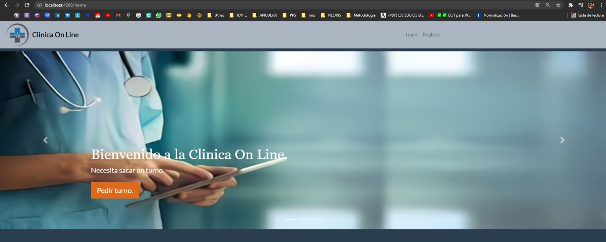
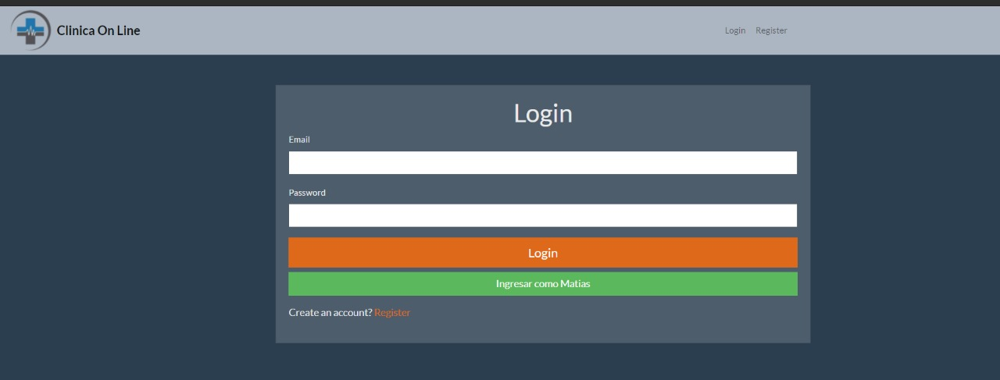
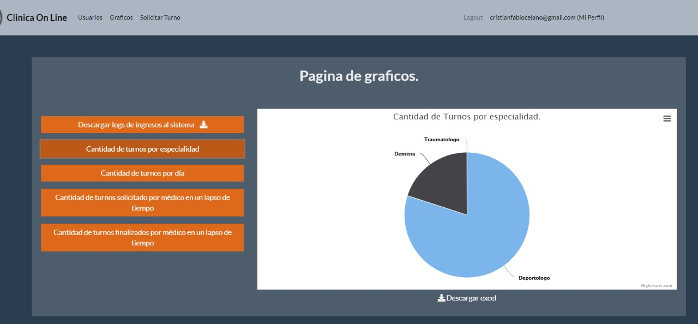
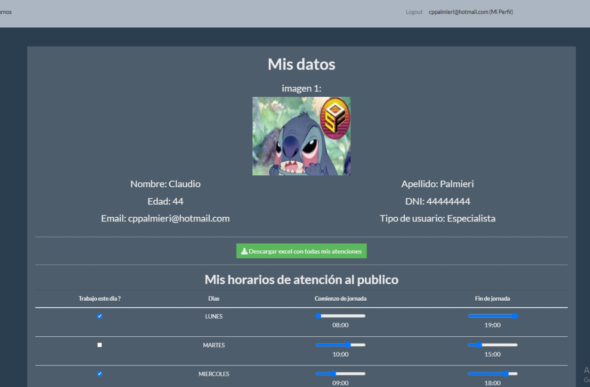
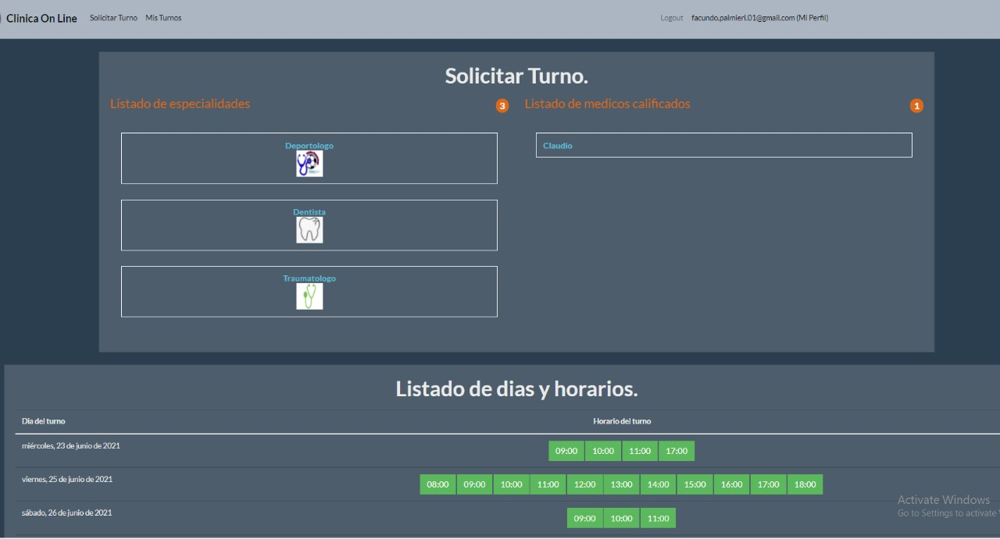
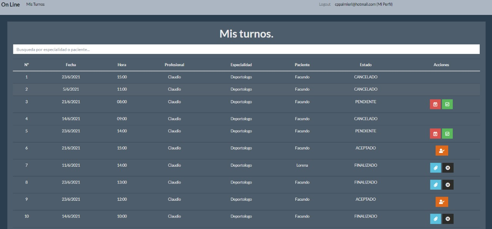

# TP LABO IV (ClinicaOnLine)


### Programador :iphone:

``` 
- Matias Palmieri
```


### Organización y Tecnologias :question:

Queres revisar el proyecto podes hacerlo ingresando a [Heroku](https://clinicaonline-mp.herokuapp.com/home) .
El proyecto esta conectado a [Firebase](https://console.firebase.google.com/project/clinicaonline-cfa90/overview), donde usaremos a la
misma como nuestro gestor de datos.
Si queres tener el codigo corriendo en tu servidor local de tu computadora podes seguir estos pasos.

``` 
git clone https://github.com/matias2806/clinicaOnLine.git
npm install (estando parado sobre la carpeta principal)
ng serve -o 

```

# Descripcion del proyecto


Consiste en una pagina de gestión de turnos en este caso para una Clinica. En la misma podes sacar turnos nuevos con distintos profesionales que se encargan de la atención de distintas especialidades. Los turnos pueden ser sacados segun la disponibilidad de nuestro Profesional.
Ademas se ofrecen multiples opciones para realizar sobre un turno, Como cancelarlo, dar feedback de la atencion, completar una encuesta entre otras cosas.

Tambien se pueden registrar profesionales que quieran atender en nuestra clinica y ellos veran toda la información que necesitan para brindar la mejor atención.


# Imagenes del sistema.


### Imagen de visualizacion de la home sin estar registrado.



### Imagen del login.



### Imagen de seccion Graficos siendo Administrador del sistema.



### Imagen de Mi Perfil siendo Especialista del sistema.



### Imagen de Solicitar Turno siendo Paciente del sistema.



### Imagen de Listado de Turnos siendo Especialista del sistema.
